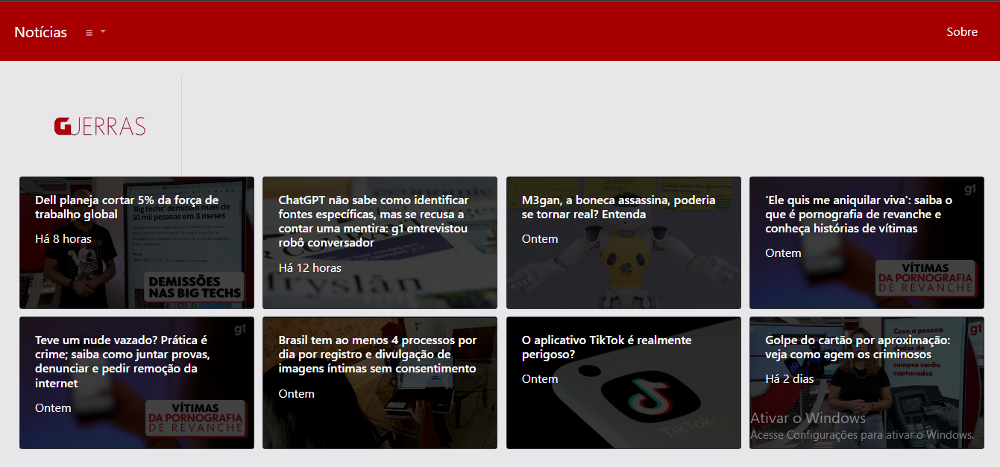

<h1 align="center">Notícias automatizadas</h1>

 

 Clique aqui para acessar o <a href="https://web-production-6a88.up.railway.app/#" target="_blank">projeto</a>.

<h2 align="center">Resumo</h2>

  Este site é responsável por fazer a raspagem de dados de sites de notícias e mostrar as notícias mais recentes destes sites, sem a necessidade de visitar cada site para ter um amplo conhecimento das notícias recentes relacionadas à tecnologia.

<h2 align="center">Funcionalidade</h2>

  O site faz o scrape de informações de sites de noticias na seção de tecnologia. Utiliza a biblioteca "requests" para acessar a URL da página e a biblioteca "BeautifulSoup" para extrair informações de cada site de noticia. As informações extraídas incluem títulos, descrições, datas e uso de RegEx para extrair links de vídeos e fotos. Os dados extraidos são armazenados e depois mostrados no propio site do projeto com as 8 noticias mais recentes de cada site de noticia.

<h2 align="center">Tecnologias usadas</h2>
 

  
  
	
	
	

