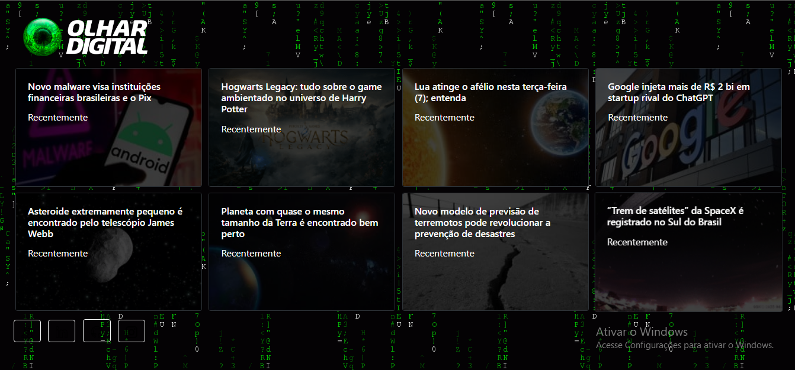

<h1 align="center">Automated News</h1>

 

<h2 align="center">Resume</h2>

  This website is responsible for scraping data from news websites and showing the latest news from these websites, without the need to visit each website to have a broad knowledge of recent news related to technology.

<h2 align="center">Functionality</h2>

  The site scrapes information from news sites in the technology section. It uses the "requests" library to access the page URL and the "BeautifulSoup" library to extract information from each news site. Extracted information includes titles, descriptions, dates, and using RegEx to extract links from videos and photos. The extracted data is stored and then displayed on the project's own website with the 8 most recent news from each news site.

<h2 align="center">Technologies used</h2>
 

  
  
	
	
	

